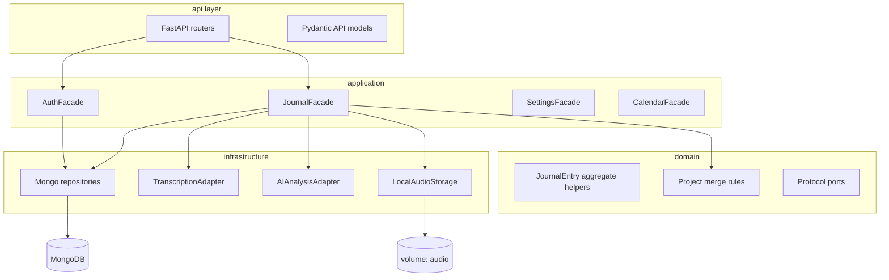

# Dockerized full-stack journaling app

## Context

The repo (`[/home/dahoe/dev/cursor-hackathon](/home/dahoe/dev/cursor-hackathon)`) is effectively empty (README, LICENSE, `.gitignore`), so this is a **greenfield** build.

## Technology choices

| Layer               | Choice                                                                                                       | Rationale                                                                                                                     |
| ------------------- | ------------------------------------------------------------------------------------------------------------ | ----------------------------------------------------------------------------------------------------------------------------- |
| Frontend            | **React 18 + Vite + TypeScript**, **React Router**, minimal CSS (e.g. **Tailwind** or CSS modules)           | Fast dev, typed API client, small bundle                                                                                      |
| Backend             | **Python 3.12 + FastAPI**, **Pydantic v2**, **uv** or **pip** + locked `requirements.txt`                    | Native async for uploads, DI-friendly, OpenAPI                                                                                |
| NoSQL + “ORM-style” | **MongoDB** + **Beanie** (async ODM on Pydantic)                                                             | Document model fits entries/projects; repository pattern over Beanie `Document` classes                                       |
| Auth                | **JWT** (access token) + **passlib[bcrypt]**                                                                 | Stateless REST; refresh optional later                                                                                        |
| File storage        | **Local filesystem adapter** behind interface (`IAudioStorage`)                                              | Docker volume mount `/data/audio`; swap S3 adapter later without touching domain                                              |
| Transcription       | **Adapter interface** + **stub** + **OpenAI Whisper API** (or compatible) implementation                     | Develop/test without keys; enable real provider via env                                                                       |
| AI analysis         | **Adapter interface** + implementation calling **OpenAI/Anthropic** with **JSON schema / structured output** | Single call returning summary, sentiment, key points, and typed lists (projects, goals, blockers, people, priorities, themes) |

## High-level architecture

Dependency rule: **API → application facades → domain services & ports → infrastructure implementations**. Nothing in `domain` imports FastAPI, Beanie, or HTTP clients.

## Backend package layout (proposed)

Under something like `[app/app/](app/app/)` or `[app/journal_api/](app/journal_api/)`:

- `**domain/**` — Pure types and rules: entry status enums, `InsightPayload` (dataclass/Pydantic-free or shared model), `ProjectMatcher` / “genuinely new project” heuristic (e.g. normalized name not in user’s existing project set; optional similarity threshold). **Protocols** (`typing.Protocol`) for `ITranscriber`, `IAIAnalyzer`, `IAudioStorage`, `IClock` (testability).
- `**application/`** — Use-case style services if needed; `**facades/`** — thin orchestration only (create entry, pipeline audio→transcribe→analyze, re-analyze, list/filter).
- `**infrastructure/`** — Beanie **document models** (collections), **repository** classes implementing small interfaces (e.g. `JournalEntryRepository`, `UserRepository`, `ProjectRepository`), **adapters** (`OpenAITranscriber`, `NoOpTranscriber`, `StructuredLLMClient`, `LocalAudioStorage`).
- `**api/`** — Routers, dependencies (`get_current_user`), request/response DTOs, exception handlers.

**Facades** should be the only entry points the HTTP layer calls, keeping routers thin (map DTOs ↔ facade calls).

## Domain model (keep simple)

**Collections (Beanie documents):**

1. `**UserDocument`** — `email`, `hashed_password`, embedded or linked `**UserSettings`** (timezone, default recording quality, notification prefs, theme, etc.).
2. `**JournalEntryDocument`** — `user_id`, `created_at`, `updated_at`, `source: text|audio`, `audio_storage_key` (path or key), `transcript`, `cleaned_text`, `summary`, `sentiment` (float or enum + score), `**insights`** subdocument: `key_points`, `projects` (strings or `{name, notes}`), `goals`, `blockers`, `people`, `priorities`, `themes`. Add `**insights_field_locks`** or `**user_edited_insight_keys: set[str]**` so **re-run analysis** can overwrite only unlocked fields (practical UX for “editable + re-run”).
3. `**ProjectDocument`** — `user_id`, `name` (normalized slug for dedup), `title`, optional `description`, `first_seen_at`, `last_mentioned_at`, `related_entry_ids[]` (cap length in application layer to avoid unbounded arrays), `status` optional.

**Project auto-create/update (simple rule):** After AI returns candidate projects, a small **domain/application** function compares normalized names to existing `ProjectDocument`s for that user; **create** if new and non-trivial (non-empty, not duplicate); **update** `last_mentioned_at` and append `entry_id` when meaningful. Avoid graph DB or heavy entity-resolution.

## REST API surface

- **Auth:** `POST /api/auth/register`, `POST /api/auth/login`, `GET /api/auth/me`
- **Entries:** `GET/POST /api/entries`, `GET/PATCH/DELETE /api/entries/{id}` (PATCH for text, cleaned text, insight fields, locks)
- **Audio pipeline:** `POST /api/entries` (multipart: optional `audio` file + optional `text`) *or* `POST /api/entries/{id}/audio` then `POST /api/entries/{id}/process` — choose **one primary flow** (recommend: single multipart `POST /api/entries` for “record flow” plus `PATCH` for edits; optional `POST .../process` to re-transcribe if needed)
- **AI:** `POST /api/entries/{id}/analyze` (body: optional `preserve_locked_fields: true`) — re-run extraction
- **Projects:** `GET /api/projects`, `PATCH /api/projects/{id}` (user rename/status); creations primarily automatic from analysis
- **Calendar:** `GET /api/calendar?from=...&to=...` — return per-day aggregates (`date`, `entry_ids` or counts) for browsing
- **Settings:** `GET/PATCH /api/settings`

Serve OpenAPI at `/docs` for `web/` typing (optional codegen later).

## Frontend structure (proposed)

Under `[web/](web/)`:

- `**src/pages/`** — `Login`, `Register` (if included), `Dashboard`, `RecordEntry`, `JournalHistory`, `Calendar`, `EntryDetail`, `Settings`
- `**src/api/`** — `fetch` wrapper with JWT header from context/storage
- `**src/components/`** — layout, audio recorder (MediaRecorder API), entry cards, insight editor (structured form bound to nested JSON), calendar grid
- **Routing** — protected routes wrapper reading auth state

**UX notes:** Record page: record → upload → show progress (transcribing / analyzing) → redirect to entry detail. Entry detail: editable fields + “Re-run AI analysis” with clear note about locked fields. History: filters + link to detail. Calendar: click day → filtered list or detail.

## Docker and Compose

- `**[docker-compose.yml](docker-compose.yml)`** — services: `mongo`, `app`, `web`, optional `mongo-express` *only for dev* (omit in prod)
- **Backend Dockerfile** — multi-stage: install deps, copy app, `uvicorn` entrypoint; env: `MONGODB_URI`, `JWT_SECRET`, `AUDIO_STORAGE_PATH`, `OPENAI_API_KEY` (optional), transcription/AI provider toggles
- **Frontend Dockerfile** — multi-stage: `npm ci`, `vite build`, **nginx** serving `dist/` with SPA fallback
- **Volumes:** named volume for Mongo data; named volume (or bind mount) for `**/data/audio`**
- **Networking:** browser uses `VITE_API_URL`; containers use `http://app:8000` on the Compose network

## Configuration and secrets

- `**.env.example`** at repo root listing all variables; real `.env` gitignored (already in [.gitignore](/home/dahoe/dev/cursor-hackathon/.gitignore))
- Adapters read config from env; **no secrets in domain**

## Testing strategy (maintainability)

- **Unit tests:** domain rules (project dedup, insight merge with locks) with pure functions
- **Service/facade tests:** mock `Protocol` ports (transcriber, AI, storage)
- **API tests:** `httpx.AsyncClient` + test Mongo (e.g. `mongomock` or ephemeral Mongo in CI) — scope minimally to critical paths (auth, create entry, analyze)

## Implementation order (recommended)

1. Docker Compose skeleton + health endpoints + Mongo connection + Beanie init
2. User + JWT auth + settings CRUD
3. Journal entry CRUD + file upload + local storage adapter
4. Transcription adapter (stub then real) wired in facade
5. AI adapter with strict JSON contract + persistence of insights + locks
6. Project auto-create/update from insights
7. Calendar aggregation endpoint
8. React shell, auth, then pages in order: login → dashboard → record → history → detail → calendar → settings
9. Polish: loading states, error toasts, basic a11y

## Files to add (initial milestone)

- `[docker-compose.yml](docker-compose.yml)`, `[app/Dockerfile](app/Dockerfile)`, `[web/Dockerfile](web/Dockerfile)`
- Backend: `pyproject.toml` or `requirements.txt`, FastAPI app factory, package layout as above
- Frontend: Vite template files, env example
- Root `[.env.example](.env.example)`

No existing codebase files require modification beyond new additions.