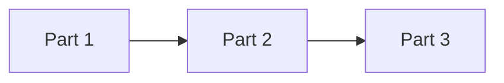

# Journaling app — work breakdown (3 parts)

This document splits delivery into **three parts**, each with **subtasks**, **checks** (definition of done / verification), and **data contracts** (see [`contracts/`](contracts/) and [`docs/DATA_CONTRACTS.md`](docs/DATA_CONTRACTS.md)).

**Environment:** **Docker Compose** runs **`mongo`**, **`stt`**, **`app`** (API under [`app/`](app/)), **`web`** (UI under [`web/`](web/)). For the API only, a local **[`app/.venv`](app/README.md)** is supported for `pytest`, editors, and host `uvicorn` (see [`app/README.md`](app/README.md)); the **`web`** app can stay fully containerized. Copy [`.env.example`](.env.example) → **`.env`** for local secrets (gitignored); for pipelines use encrypted **git secrets** as in [docs/DEPLOYMENT.md](docs/DEPLOYMENT.md). Dev overrides: [`docker-compose.dev.yml`](docker-compose.dev.yml).

---

## Part 1 — Platform, persistence, and identity

**Goal:** Runnable stack (Docker Compose), MongoDB + ORM layer, JWT auth, user + settings APIs, baseline web UI shell.

| ID | Subtask | Check |
|----|---------|--------|
| P1.1 | Add `docker-compose.yml`, [`app/Dockerfile`](app/Dockerfile), [`web/Dockerfile`](web/Dockerfile), [`.env.example`](.env.example), volume mounts for Mongo + audio | `docker compose config` succeeds; `docker compose up` starts `mongo`, `app`, `web` without build errors |
| P1.2 | Wire FastAPI app, Beanie init, health route `GET /api/health` | `curl` returns 200 with `{ "status": "ok", "database": "connected"|"disconnected" }` |
| P1.3 | Implement `UserDocument`, `UserSettings` (embedded or separate), repositories | Documents match [`contracts/user-settings.schema.json`](contracts/user-settings.schema.json) fields; indexes on `email` (unique) |
| P1.4 | Auth: register, login, `GET /api/auth/me`; bcrypt + JWT dependency | Contracts in [`docs/DATA_CONTRACTS.md`](docs/DATA_CONTRACTS.md) §Auth; unauthorized → 401 |
| P1.5 | Settings: `GET/PATCH /api/settings` scoped to user | PATCH round-trip persists per [`contracts/user-settings.schema.json`](contracts/user-settings.schema.json) |
| P1.6 | Web: Vite + React + router, login page, API client with token storage, protected route stub | Login reaches API (`app` service); dashboard placeholder behind auth |

**Data contracts for Part 1:** [`contracts/auth-responses.schema.json`](contracts/auth-responses.schema.json), [`contracts/user-settings.schema.json`](contracts/user-settings.schema.json), §Auth and §Settings in [`docs/DATA_CONTRACTS.md`](docs/DATA_CONTRACTS.md).

---

## Part 2 — Journal domain, pipeline, and supporting APIs

**Goal:** Entries CRUD, audio persistence, transcription + AI adapters (stub + real behind env), structured insights with user locks, project upsert, calendar endpoint.

| ID | Subtask | Check |
|----|---------|--------|
| P2.1 | `JournalEntryDocument` + repository + `GET/POST/PATCH/DELETE /api/entries` | Payloads match [`contracts/journal-entry.schema.json`](contracts/journal-entry.schema.json); ownership enforced |
| P2.2 | `IAudioStorage` + local adapter; multipart upload; store path on entry | File appears under audio volume; `audio_storage_key` set |
| P2.3 | `ITranscriber` stub + optional OpenAI (or compatible) impl; integrate in facade after upload | With stub: deterministic fake transcript; with key: real transcript (manual spot-check) |
| P2.4 | `IAIAnalyzer` structured JSON (summary, sentiment, insights); persist + `insights_field_locks` | Response matches [`contracts/insights.schema.json`](contracts/insights.schema.json); PATCH respects locks per [`docs/DATA_CONTRACTS.md`](docs/DATA_CONTRACTS.md) |
| P2.5 | `POST /api/entries/{id}/analyze` re-run; skip locked fields | Unlocked fields refresh; locked unchanged (unit or integration test) |
| P2.6 | `ProjectDocument` + auto create/update from AI `projects`; `GET/PATCH /api/projects` | New name creates row; repeat mentions update `last_mentioned_at` |
| P2.7 | `GET /api/calendar?from=&to=` — entries grouped by UTC date (or user tz from settings) | Response shape per [`docs/DATA_CONTRACTS.md`](docs/DATA_CONTRACTS.md) §Calendar |

**Data contracts for Part 2:** [`contracts/journal-entry.schema.json`](contracts/journal-entry.schema.json), [`contracts/insights.schema.json`](contracts/insights.schema.json), [`contracts/calendar-response.schema.json`](contracts/calendar-response.schema.json), §Entries, §Insights, §Calendar, §Projects in [`docs/DATA_CONTRACTS.md`](docs/DATA_CONTRACTS.md).

---

## Part 3 — Product UX, polish, and quality gates

**Goal:** Full pages (dashboard, record, history, calendar, entry detail, settings), recording flow, editable insights + re-analyze, tests, README hygiene.

| ID | Subtask | Check |
|----|---------|--------|
| P3.1 | Dashboard: recent entries, nav to record/history/calendar/settings | Lists data from API; empty states handled |
| P3.2 | Record flow: MediaRecorder → upload → progress → entry detail | End-to-end against Part 2 pipeline (or stub in CI) |
| P3.3 | History + calendar browsing + entry detail with structured editors | Edits persist via PATCH; re-analyze button calls analyze endpoint |
| P3.4 | Settings UI bound to `/api/settings` | Matches contract |
| P3.5 | Tests: domain (locks, project dedup), facade with mocked ports, critical API tests | `docker compose -f docker-compose.yml -f docker-compose.dev.yml run --rm app pytest`; web production build via `docker compose build web` (no local `npm`) |
| P3.6 | README: prerequisites, `docker compose up`, default URLs, env vars | New developer can start stack from README only |

**Data contracts for Part 3:** Same as Parts 1–2; UI must not invent field names—use OpenAPI or [`docs/DATA_CONTRACTS.md`](docs/DATA_CONTRACTS.md) as source of truth.

---

## Cross-cutting checks (all parts)

- **Secrets:** No keys committed; only [`.env.example`](.env.example) documents variables.
- **Layering:** `domain/` does not import FastAPI, Beanie, or HTTP client libraries.
- **Contracts:** Breaking API or storage shape changes require updating `contracts/*.json` and [`docs/DATA_CONTRACTS.md`](docs/DATA_CONTRACTS.md).

---

## Dependency order

Part 2 assumes Part 1 auth and settings; Part 3 assumes Part 2 entry and analyze APIs exist.
