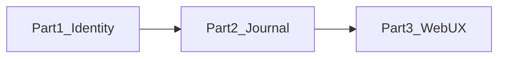
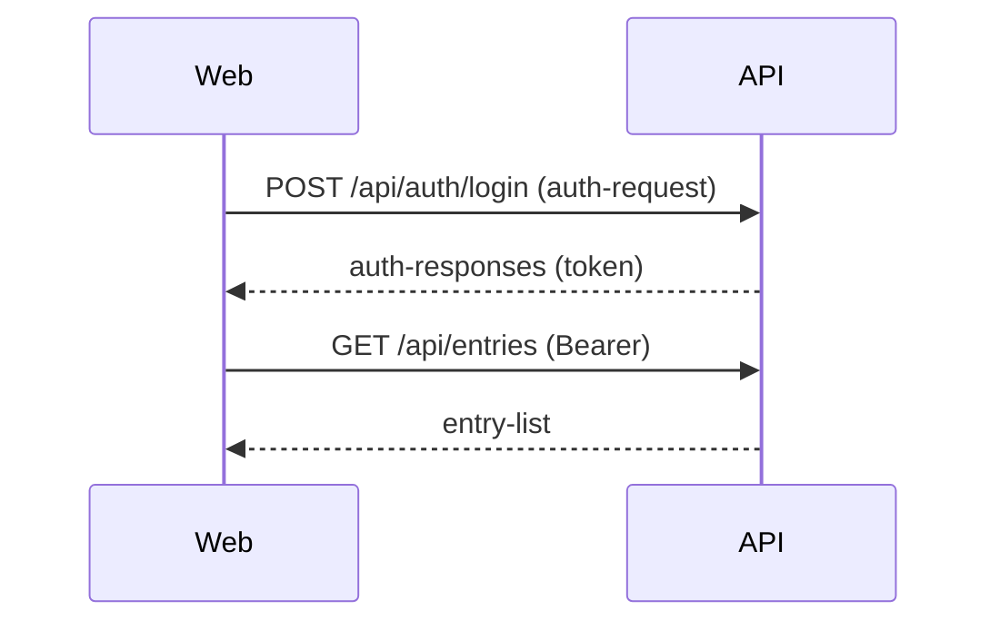
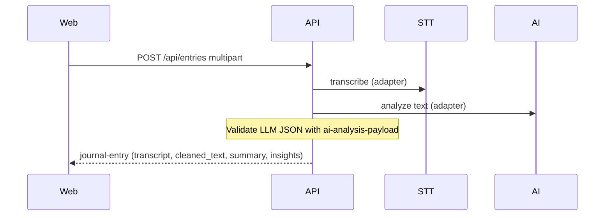
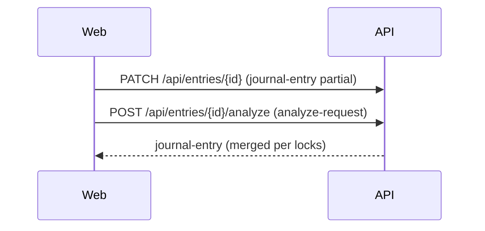

# Part 1–3 interactions and data contracts

This document ties **[`WORK_PLAN.md`](../WORK_PLAN.md)** phases to **HTTP interactions**, **JSON Schemas** under [`contracts/`](../contracts/), and **web client** responsibilities. The machine-readable registry is **[`contracts/part-interactions.json`](../contracts/part-interactions.json)**.

---

## Part dependency

- **Part 2** assumes **Part 1** (`Authorization: Bearer`, settings, health).
- **Part 3** assumes **Parts 1–2**; it does **not** introduce new wire formats—it binds UI to the same schemas.

---

## Contract index by part

| Part | Focus | Primary schema files |
|------|--------|-------------------------|
| **1** | Stack, DB, auth, settings | [`health.schema.json`](../contracts/health.schema.json), [`auth-request.schema.json`](../contracts/auth-request.schema.json), [`auth-responses.schema.json`](../contracts/auth-responses.schema.json), [`me-response.schema.json`](../contracts/me-response.schema.json), [`user-settings.schema.json`](../contracts/user-settings.schema.json) |
| **2** | Entries, audio, STT, AI, projects, calendar | [`journal-entry.schema.json`](../contracts/journal-entry.schema.json), [`insights.schema.json`](../contracts/insights.schema.json), [`entry-list.schema.json`](../contracts/entry-list.schema.json), [`analyze-request.schema.json`](../contracts/analyze-request.schema.json), [`ai-analysis-payload.schema.json`](../contracts/ai-analysis-payload.schema.json), [`project-resource.schema.json`](../contracts/project-resource.schema.json), [`project-list.schema.json`](../contracts/project-list.schema.json), [`calendar-response.schema.json`](../contracts/calendar-response.schema.json) |
| **3** | Pages, recording UX, tests | *(none new)* — consume Part 1–2 schemas; align TypeScript types with OpenAPI or these JSON files |

Canonical prose for each endpoint remains in [`DATA_CONTRACTS.md`](DATA_CONTRACTS.md).

---

## Part 1 ↔ Part 2 boundary

| From | To | Contract |
|------|-----|------------|
| P1 issues JWT | P2 protected routes | `Authorization: Bearer <access_token>` from [`auth-responses.schema.json`](../contracts/auth-responses.schema.json) |
| P1 user settings (e.g. timezone) | P2 calendar grouping / display | [`user-settings.schema.json`](../contracts/user-settings.schema.json) informs UI; API may use `timezone` when grouping dates |

---

## Part 2 ↔ Part 3 boundary

| Part 2 artifact | Part 3 consumer | Rule |
|-------------------|-----------------|------|
| `JournalEntry` | Dashboard, history, detail, calendar links | Render only fields in [`journal-entry.schema.json`](../contracts/journal-entry.schema.json); nested [`insights.schema.json`](../contracts/insights.schema.json) |
| `insights_field_locks` | Entry detail + re-analyze | UI edits locks and calls `POST .../analyze` with [`analyze-request.schema.json`](../contracts/analyze-request.schema.json) |
| Multipart `POST /api/entries` | Record flow | Form fields per [`part-interactions.json`](../contracts/part-interactions.json) `P2.entries.create` |
| Error `detail` | Global error UI | FastAPI default; see [`DATA_CONTRACTS.md`](DATA_CONTRACTS.md) global conventions |

---

## Cross-part sequences (data contract chain)

### A — Login then list entries

### B — Create entry with audio (transcribe + analyze)

### C — Edit insights, re-run AI with locks

---

## Versioning

- Bump **`contracts/part-interactions.json`** `version` when adding or renaming interactions.
- Any change to JSON Schemas in [`contracts/`](../contracts/) should update [`DATA_CONTRACTS.md`](DATA_CONTRACTS.md) and, when relevant, this file.
